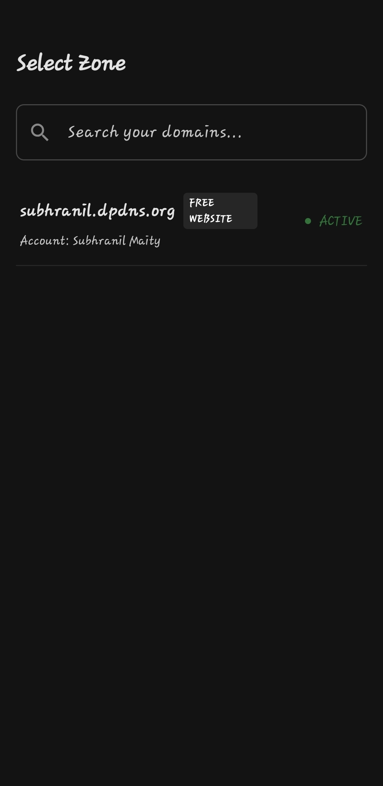
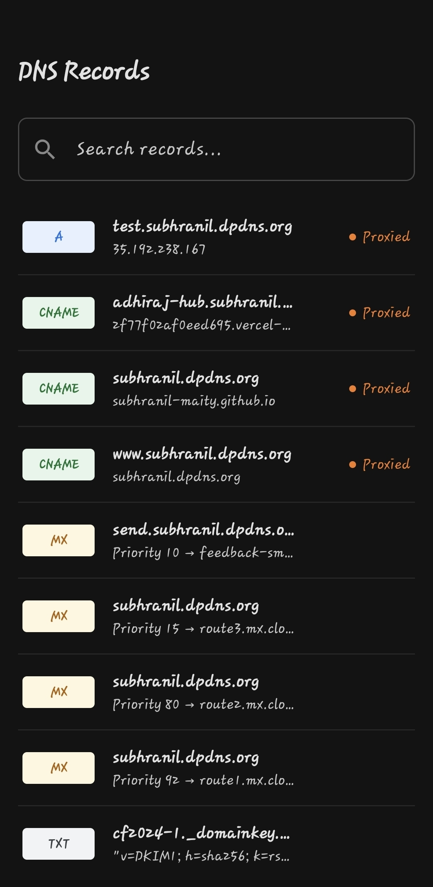
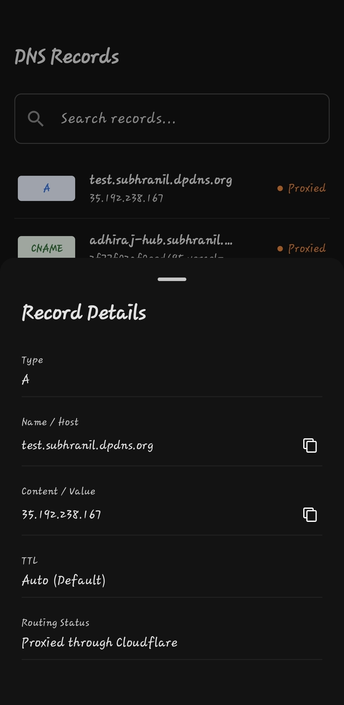

# CloudDnsManager (View only For Now)

An Android app for managing your Cloudflare DNS infrastructure on the go.

---

## What is this?

I built CloudDnsManager because I wanted a fast, native way to browse my Cloudflare zones and DNS records from my phone. The Cloudflare web dashboard works fine on desktop, but on mobile it is clunky and slow. I wanted something that felt like a real Android app — clean, responsive, and built for touch.

Right now it's **view-only**, meaning you can browse and inspect your zones and DNS records. I have plans to add editing in the future, but the read-only experience is already useful for quickly checking record values, TTLs, and proxied status while away from my desk.

**"View only For Now"** — because full CRUD operations for DNS management are on the roadmap.

---

## Features

- **API Token Verification** — Enter your Cloudflare API token; the app verifies it against Cloudflare's API before proceeding
- **Session Management** — Token is encrypted at-rest and kept alive for the app session
- **Zone Browsing** — View all zones (domains) associated with your account, with live status and plan info
- **DNS Record Inspection** — Browse all DNS records for a selected zone
- **Search & Filter** — Quickly find records by name, type, or content
- **Record Detail View** — Tap any record to see full details in a bottom sheet
- **Error Recovery** — Network errors show a dedicated retry screen instead of a cryptic dialog
- **Pure State Machine UI** — Every screen is a pure function of its state. No surprises.

---

## Screenshots

| | |
|---|---|
|  |  |
|  | |

---

## Technology Stack

I chose a modern Android stack that keeps the codebase lean and maintainable:

| Layer | Technology |
|-------|-----------|
| UI | Jetpack Compose + Material 3 |
| Architecture | MVVM with MVI-style Intents |
| DI | Koin |
| Networking | Ktor (CIO engine) |
| Serialization | Kotlinx Serialization |
| Navigation | AndroidX Navigation 3 |
| Storage | DataStore (encrypted) |
| Encryption | AES + Base64 |

---

## Getting Started

### Prerequisites

- Android Studio Hedgehog (2023.1.1) or newer
- JDK 17+
- Android SDK 31+ (minSdk), compiled against SDK 37

### Build & Run

1. Clone the repo
2. Open in Android Studio
3. Sync Gradle
4. Run on an emulator or physical device (API 31+)

```bash
./gradlew :app:installDebug
```

---

## Usage

1. **On First Launch**: The app shows the Onboarding screen
2. **Enter API Token**: Paste your Cloudflare API token (requires Zone:Read permissions)
3. **Verify**: The app validates your token against Cloudflare
4. **Browse Zones**: You will see all zones your token can access
5. **Inspect Records**: Tap a zone to see its DNS records
6. **Search**: Use the search bar to filter records by name, type, or content
7. **View Details**: Tap any record to see full details (TTL, proxied status, etc.)
8. **Go Back**: Use the system back button or the retry screen to navigate

---

## Architecture

I followed a **pure state machine** approach for the frontend. Every screen is driven by:

1. **State**: A sealed interface with distinct substates for every possible screen condition (Loading, Error, Data)
2. **Intent**: A sealed class representing every possible user action
3. **ViewModel**: Processes intents, performs side effects, and transitions between states

This means the Compose UI is a pure function of state — easy to test, reason about, and debug. The app uses an exhaustive `when` block on the sealed state, so every UI state is intentional and no impossible states can be rendered.

The foundation is solid, and adding write operations is the natural next step now that the architecture is proven.

For the full technical breakdown, see [architecture.md](architecture.md).

---

## Why "View only For Now"?

I wanted to ship something useful before building the full CRUD. The read-only mode is genuinely handy for quick lookups — checking if a CNAME points where you think it does, verifying a zone is using the right nameservers, confirming a TTL value. The foundation is solid, and adding write operations is the natural next step now that the architecture is proven.

---

## Author

Built by **Subhranil Maity**.

I work on this in my free time. If you find it useful, let me know. If you want to contribute (especially on the CRUD features), PRs are welcome.
