# CloudDnsManager

An Android app for managing your Cloudflare DNS records and Email Routing on the go.

**[Download the latest release](https://github.com/Subhranil-Maity/CloudDnsManager/releases/latest)** · [Changelog](CHANGELOG.md)

---

## What is this?

I built CloudDnsManager because I wanted a fast, native way to manage my Cloudflare zones from my phone. The Cloudflare web dashboard works fine on desktop, but on mobile it is clunky and slow. I wanted something that felt like a real Android app — clean, responsive, and built for touch.

It started as a view-only browser. As of **v1.0** you can create, edit and delete DNS records, manage Email Routing aliases and forwarding addresses, and see who has been emailing your aliases. Because it can now change things, every change is protected by a confirmation and your PIN or biometrics.

---

## Features

### DNS
- **Browse and search** every record in a zone, by name, type, content, comment or note
- **Create, edit and delete** A, AAAA, CNAME, TXT, MX, NS, CAA and SRV records, with a form tailored to each type (TTL, proxied, priority, SRV/CAA fields, comment)
- **Locked by Cloudflare:** records Cloudflare manages itself, such as Email Routing records, are clearly marked and protected
- **Your own locks:** lock a record so it can't be edited or deleted by mistake. The lock is synced to Cloudflare through the record's comment, so it follows you across devices
- **Private notes** on any record, stored only on your device

### Email Routing
- **Aliases:** list, search, enable or disable, change where they forward, delete
- **Random aliases** like `quiet-river-4821@yourdomain.com`, one tap to generate
- **Destination addresses:** see verified and pending addresses, and add new ones (Cloudflare sends a verification email)
- **Activity:** incoming mail per zone or per alias (from, to, subject, status)
- **Copy buttons**, plus private notes and locks for aliases and addresses

### Security
- **Optional app PIN with biometric unlock.** The app locks on launch and after a minute in the background, with a cooldown after repeated wrong PINs
- **Every change needs authentication:** PIN or biometrics, or your phone's screen lock if you haven't set an app PIN
- **Encrypted storage:** the API token is encrypted at rest with an Android Keystore key, and only a salted hash of the PIN is stored
- While a PIN is set, the app is hidden from screenshots and the recent-apps preview

---

## Screenshots

All screenshots use made-up sample data (`example.com`, `alex@example.net`, …) and the app's dark theme.

### Getting around

<table>
  <tr>
    <td align="center" width="33%">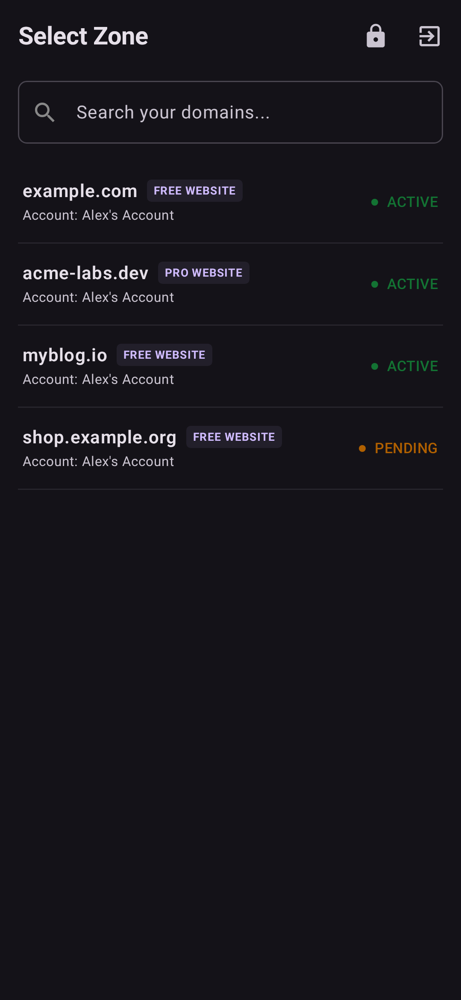</td>
    <td align="center" width="33%">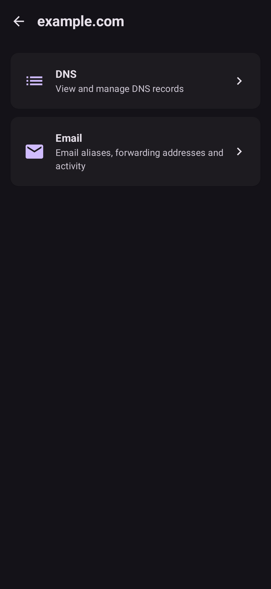</td>
  </tr>
  <tr>
    <td valign="top"><b>Zones:</b> every zone your token can access, with its plan and status. Search at the top. The lock icon opens Security settings, and the icon next to it logs out.</td>
    <td valign="top"><b>Zone page:</b> pick <b>DNS</b> to manage records or <b>Email</b> for Email Routing.</td>
  </tr>
</table>

### DNS

<table>
  <tr>
    <td align="center" width="33%">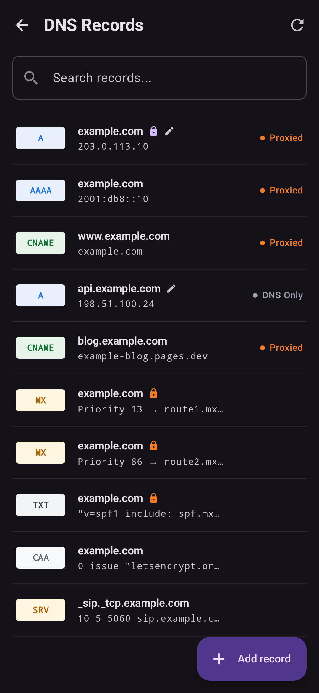</td>
    <td align="center" width="33%">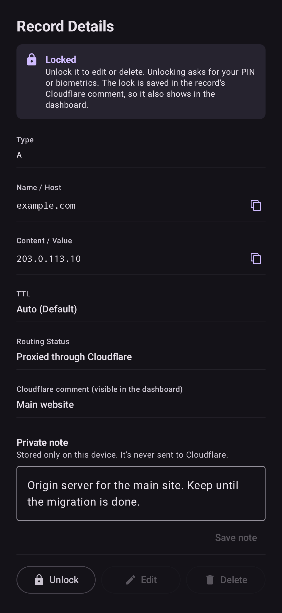</td>
    <td align="center" width="33%">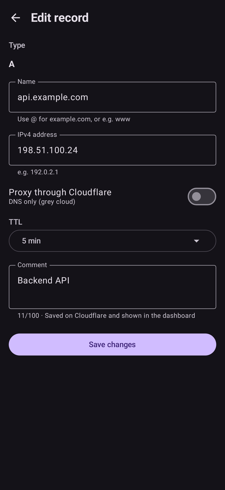</td>
  </tr>
  <tr>
    <td valign="top"><b>Records:</b> type, name, value and proxy status at a glance. The purple lock is your own lock and the orange lock is a record Cloudflare manages (here the Email Routing MX and SPF records). A pencil means the record has a private note.</td>
    <td valign="top"><b>Record details:</b> copy the name or value, read the Cloudflare comment, keep a private note, and lock, unlock, edit or delete. A locked record can't be edited or deleted until you unlock it with your PIN or biometrics.</td>
    <td valign="top"><b>Editor:</b> create or edit A, AAAA, CNAME, TXT, MX, NS, CAA and SRV records, with the right fields for each type: proxy switch, TTL, priority and comment.</td>
  </tr>
</table>

### Email Routing

<table>
  <tr>
    <td align="center" width="33%">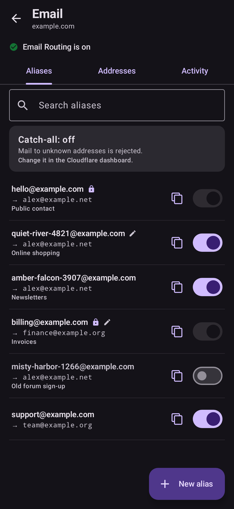</td>
    <td align="center" width="33%">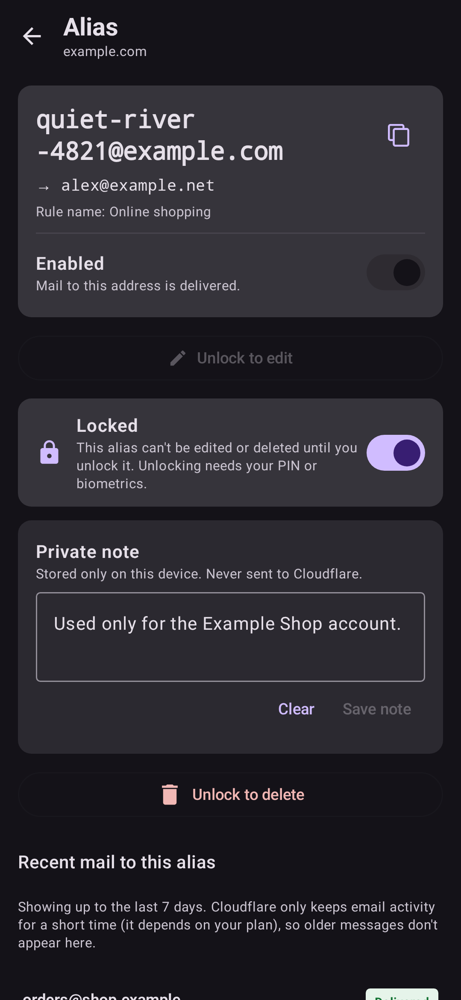</td>
    <td align="center" width="33%">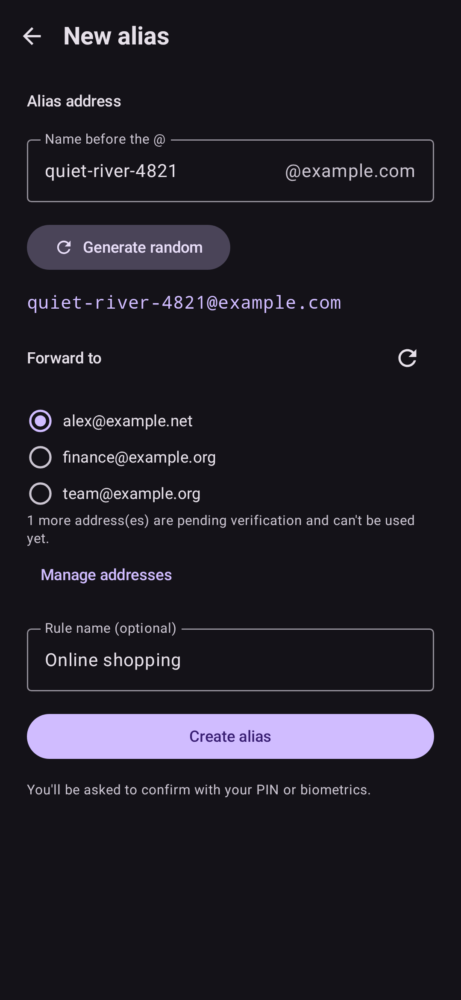</td>
  </tr>
  <tr>
    <td valign="top"><b>Aliases:</b> every alias and where it forwards, with a copy button and an on/off switch. Locked aliases can't be switched off by accident. The catch-all rule is shown at the top.</td>
    <td valign="top"><b>Alias details:</b> copy the address, enable or disable it, change where it forwards, lock it, keep a private note, and see recent mail sent to it.</td>
    <td valign="top"><b>New alias:</b> type a name or tap <b>Generate random</b> for a readable, hard-to-guess alias like <code>quiet-river-4821</code>. It can forward to any of your verified addresses.</td>
  </tr>
  <tr>
    <td align="center">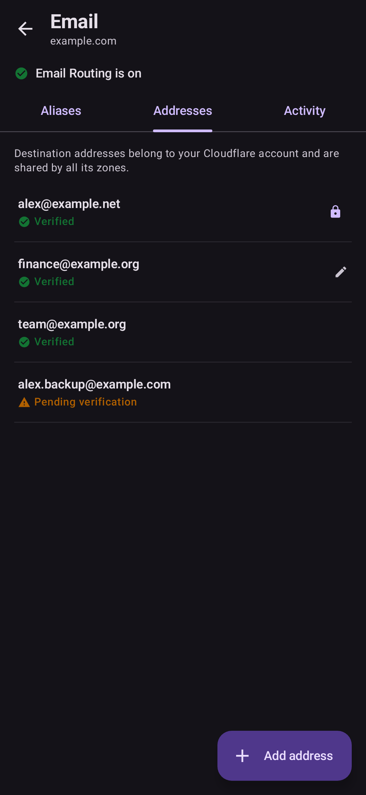</td>
    <td align="center">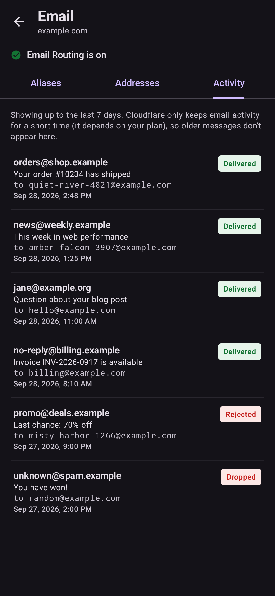</td>
    <td></td>
  </tr>
  <tr>
    <td valign="top"><b>Addresses:</b> the inboxes your aliases can forward to, with <b>Verified</b> or <b>Pending verification</b> status. Adding one makes Cloudflare send it a verification link.</td>
    <td valign="top"><b>Activity:</b> recent incoming mail showing who sent it, which alias received it, the subject, and whether it was delivered, rejected or dropped.</td>
    <td></td>
  </tr>
</table>

### Security

<table>
  <tr>
    <td align="center" width="33%">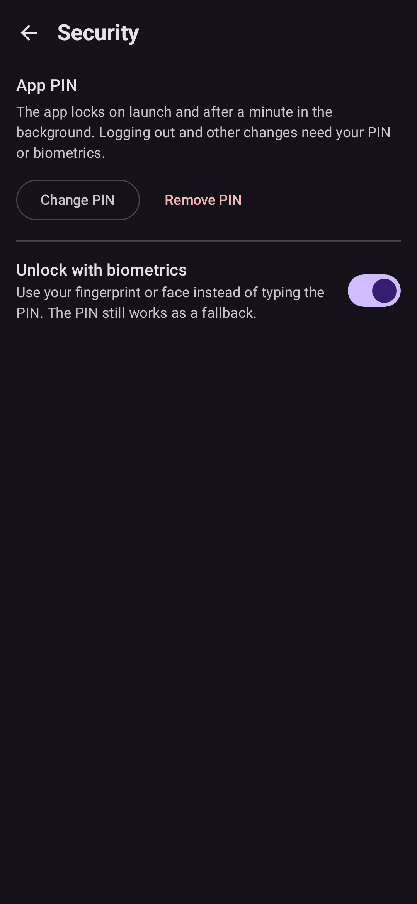</td>
    <td align="center" width="33%">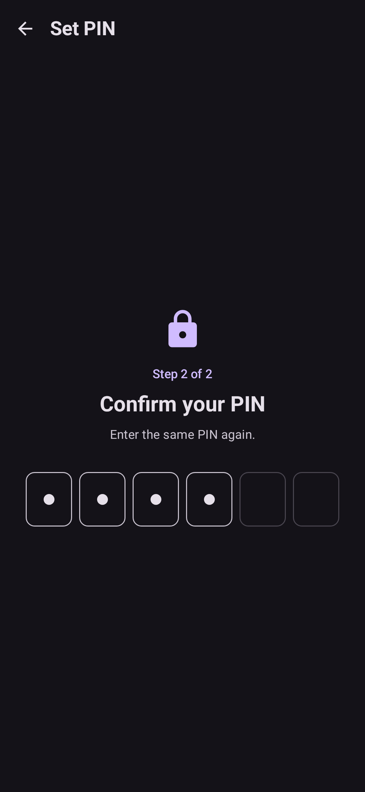</td>
    <td width="33%"></td>
  </tr>
  <tr>
    <td valign="top"><b>Security settings:</b> set, change or remove the app PIN, and turn on fingerprint or face unlock.</td>
    <td valign="top"><b>PIN setup:</b> choose a 6-digit PIN, then confirm it. The app then locks on launch and after a minute in the background, and every change needs your PIN or biometrics.</td>
    <td></td>
  </tr>
</table>

<sub>Screenshots are rendered from Compose previews (<code>app/src/screenshotTest</code>) with <code>./gradlew :app:updateDebugScreenshotTest</code>. The Dark variants are copied here.</sub>

---

## Installation

1. Download `CloudDnsManager-v1.0.apk` from the [latest release](https://github.com/Subhranil-Maity/CloudDnsManager/releases/latest).
2. Open it on your phone and allow installing from this source if Android asks.
3. Requires **Android 12 (API 31)** or newer. Upgrading from v0.1 keeps your saved token.

---

## API token permissions

Create a token in the Cloudflare dashboard (**My Profile → API Tokens → Create Token → Custom token**) and grant what you need:

| Scope | Permission | Needed for |
|---|---|---|
| Zone | Zone: Read | Listing zones (required) |
| Zone | DNS: Edit | Viewing and changing DNS records (DNS: Read is enough to only view) |
| Zone | Email Routing Rules: Edit | Viewing and changing email aliases |
| Account | Email Routing Addresses: Edit | Destination (forwarding) addresses |
| Zone | Analytics: Read | Email activity |
| Zone | Zone Settings: Read | *(optional)* Showing whether Email Routing is switched on |

- Under **Zone Resources**, include the zones you want to manage.
- Under **Account Resources**, include every account whose forwarding addresses you want to manage. Addresses belong to an account, not a zone.

If something isn't allowed, the app tells you which permission is likely missing, along with Cloudflare's own reason.

---

## Usage

1. **First launch:** paste your Cloudflare API token. The app verifies it before continuing.
2. **Pick a zone**, then choose **DNS** or **Email**.
3. **DNS:** tap a record for details, its note and its lock. Use **Add record** to create one, or **Edit** / **Delete** from the details.
4. **Email:** switch between the **Aliases**, **Addresses** and **Activity** tabs. Use **Generate random** when creating an alias.
5. **Security:** tap the lock icon on the zones screen to set a PIN and turn on biometric unlock.
6. **Log out** from the zones screen. This removes the token, PIN, notes and locks from the device.

---

## Technology Stack

I chose a modern Android stack that keeps the codebase lean and maintainable:

| Layer | Technology |
|-------|-----------|
| UI | Jetpack Compose + Material 3 |
| Architecture | MVVM with MVI-style Intents (separate State / Intent / ViewModel per screen) |
| DI | Koin |
| Networking | Ktor (CIO engine), Cloudflare REST v4 + GraphQL Analytics |
| Serialization | Kotlinx Serialization |
| Navigation | AndroidX Navigation 3 |
| Storage | DataStore (encrypted with an Android Keystore AES key) |
| Security | AndroidX Biometric, PBKDF2 PIN hashing |
| Startup | AndroidX SplashScreen |

---

## Getting Started (building from source)

### Prerequisites

- A recent Android Studio
- JDK 17+
- Android SDK 31+ (minSdk), compiled against SDK 37

### Build & Run

1. Clone the repo
2. Open in Android Studio
3. Sync Gradle
4. Run on an emulator or physical device (API 31+)

```bash
./gradlew :app:installDebug
./gradlew :app:testDebugUnitTest   # unit tests
```

---

## Architecture

A **pure state machine** approach was followed for the frontend. Every screen is driven by:

1. **State**: an immutable state with sealed substates for every screen condition (Loading, Error, Data)
2. **Intent**: a sealed interface representing every possible user action
3. **ViewModel**: processes intents, performs side effects, and transitions between states

This means the Compose UI is a pure function of state — easy to test, reason about, and debug.

DNS and Email are **self-contained feature packages**, each with its own navigation, dependency injection and API class. They share an encrypted local store, one central lock manager, and an `AuthGate` that every change must pass through.

For the full technical breakdown, including the security rules, see [architecture.md](architecture.md).

---

## Author

Built by **Subhranil Maity**.

I work on this in my free time. If you find it useful, let me know. If you want to contribute, PRs are welcome.
